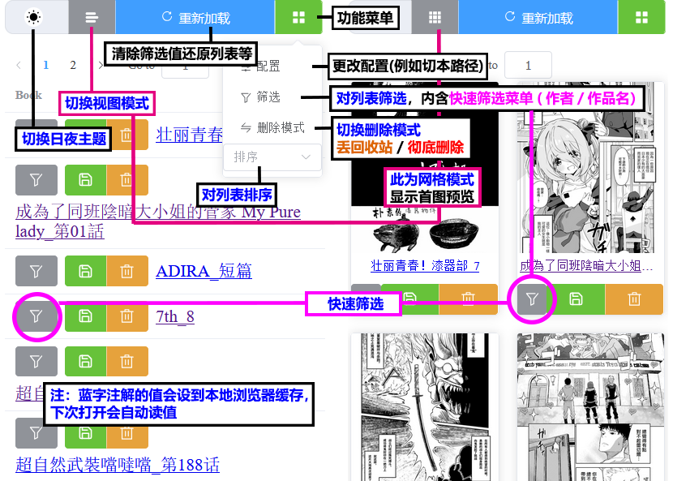

<div align="center">

   <a href="https://github.com/jasoneri/ComicGUISpider" target="_blank">
    
  </a>
  <h1 id="logo">redViewer(rV)</h1>
  
  
  
  <br>
  
  
  

  <p align="center">
  <a href="#️部署更新运行多合一脚本">📦多功能脚本</a> | 
  <a href="https://github.com/jasoneri/redViewer/wiki/FAQ">📖FAQ</a> | 
  <a href="https://github.com/jasoneri/redViewer/wiki/Feat">🎲功能说明</a>
  </p>
</div>

## 📑介绍

用手机浏览器局域网等阅读pc本地的漫画

### ▼ 📚列表/网格预览 ▼



> [!Tip]  
> - 快速筛选的匹配模式请参考 [🎲功能说明](https://github.com/jasoneri/redViewer/wiki/Feat)，用 CGS 下的就不用参考了😎  

### ▼ 📗阅读预览 ▼


> [!Tip]  
> - 建议保留导航按钮或滚动条可视，除非对纯图片阅读有极高要求，否则大页数途中会缺少可动操作  

## 🚀快速开始

### 0. 准备

<details>
<summary> 内容目录树参考 👈点击展开</summary>

CGS 下载漫画<u>**并整合章节后(表漫的话)**</u>的话就是这结构，否则把漫画放进该目录的 `web` 文件夹内

```shell
D:\Comic                              
   ├── web                            # 放内容（使用`CGS`的话目录结构就是已定的，使用自定义的话就需要创建这个`web`文件夹）
   |    └── GrandBlue碧蓝之海_第62话
   |         ├── 1.jpg
   |         ├── 2.jpg
   |         ......
   └── web_handle                     # 程序创建的操作处理目录
        ├── save                      # 被保存的书
        ├── remove                    # 被移除的书
        └── record.txt                # 保存/移除/删除的记录，与`CGS.exe`的工具箱中的`已阅最新话数记录`关联
```

配置：`backend/conf.yml`中`path`的值，默认`D:\Comic`

</details>

### ♦️1. 部署/更新/运行—多合一脚本

找一个非中文目录（例如 `D:/rv`）右键打开终端，然后执行如下命令

#### windows

```shell
irm https://gitee.com/json_eri/redViewer/raw/master/deploy/online_scripts/windows.ps1 | iex
```

#### macOS

```shell
curl -fsSL https://gitee.com/json_eri/redViewer/raw/master/deploy/online_scripts/macos.sh | zsh
```

#### linux

```shell
curl -fsSL https://gitee.com/json_eri/redViewer/raw/master/deploy/online_scripts/linux.sh | zsh
```

部署代码过后会残留脚本，win 后续使用本地的 `./rV.bat`，macOS / linux 后续使用本地的 `zsh rV.sh`  
后续使用避免再用远程脚本导致重复套娃安装（防呆路径错乱）  

> [!Warning]  
> win 报错相关：①激活 win 系统；  
> ②`控制面板 > 时钟与区域 > 区域 > 更改系统区域设置 > 勾选beta版 unicode UTF-8 > 重启`  

🚩 [关于脚本有任何问题直接 issue 反馈](https://github.com/jasoneri/redViewer/issues/new)

### 2.使用

启动后终端会显示局域网ip与端口 `Network:`行，手机进浏览器照样填地址即可  
例如 `192.168.xxx.xx`, 尾号非1  
建议 PC 设置固定局域网 ip，阅读端做网址收藏

> [🎥使用指南参考](https://www.veed.io/view/zh-CN/688ae765-2bfb-4deb-9495-32b24a273373?panel=comments)，从 `01:52` 开始含有 redViewer 的使用部分

## 📢更新

✅ 区分空列表/后端异常  
✅ 修复/优化配置读取目录切换时的静态资源访问问题  
✅ 全面使用 uv 代替 纯python 运行  

### TODO LIST

🔳方向：前端部分通过Capacitor往app发展，重点为离线缓存/在线激活后同步离线操作  
🔳githb-pages做成体验（修改前后的部分细则），寻找免费后端服务  

> [🕑更新历史](https://github.com/jasoneri/redViewer/wiki/Changelog)

## 💬交流

详见 [❓FAQ](https://github.com/jasoneri/redViewer/wiki/FAQ) 置顶

## 🔇开源许可

详见 [Apache License 2.0](https://github.com/jasoneri/redViewer/blob/master/LICENSE)

---


