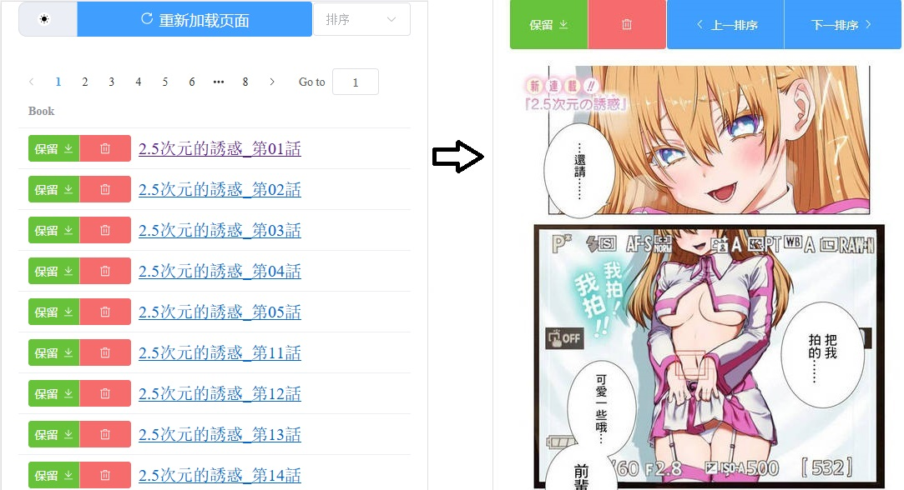

<div align="center">
  <h1 id="koishi">ComicViewer</h1>
  
  
</div>


## 📑介绍
超简单 fastapi + vue3 项目， pc本地下漫画(或任意图片目录)后用手机浏览器进行局域网阅读


▼ 预览 ▼



> 打包好的开箱即用版 → [点击前往下载页面](https://github.com/jasoneri/comic_viewer/releases)，包名 `comic_viewer.7z`<br>
> 内含另外的 `部署指南` ，无需看以下说明
>
> 使用可以参考 [CGS的使用指南](https://www.veed.io/view/zh-CN/688ae765-2bfb-4deb-9495-32b24a273373?panel=comments) ，
> `01:52` 开始


## 📢更新

### V1.6 | 2024-09-13

增加筛选按钮（重新加载键的右侧），<br>
能根据关键字筛出使页面仅显示包含关键字的书（按重新加载就能恢复）<br>
> mark一下：用手机edge测试时输入消息框与输入法之间有空白需要划一下去掉空白才能输入筛选成功，已反馈官方，用手机自带浏览器倒是没问题

## ⚡️准备
### 版本
+ Python==3.12.3（实际3.8也行）
+ node  // newest
### backend
在`backend/conf.yml`修改目录，默认是`D:\Comic`, 把漫画放进该目录内，示例如下
```shell
yourComicPath
└── GrandBlue碧蓝之海_第62话
     ├── 1.jpg
     ├── 2.jpg
     ......
```
```shell
cd backend
python -m pip install -r requirements.txt
```

### frontend
默认端口为8080，配置在frontend/vite.config.js
```shell
cd frontend
npm i
```
## 🚀部署运行
```shell
cd frontend
npm start
```

## ✈️使用
启动后终端会显示局域网ip与端口 `Network:`行

手机进浏览器照样填地址即可，如预览所示

> 若需要删除功能，前往`backend/api/routes/comic.py`搜索`book.handle == "del"`，把下面两行解除注释
> （<kbd># </kbd>去掉，注意去掉<kbd>#</kbd>后空格）

## 💬交流


## 🔰开源许可
详见 [MIT License](https://github.com/jasoneri/comic_viewer/blob/master/LICENSE)
