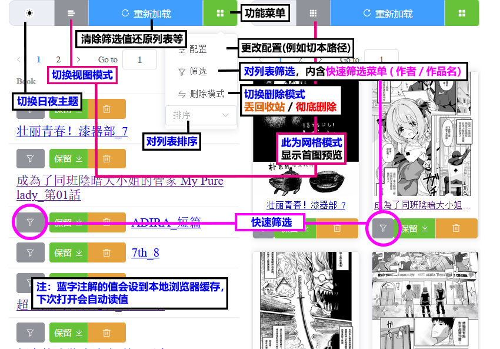

<div align="center">

   <a href="https://github.com/jasoneri/ComicGUISpider" target="_blank">
    
  </a>
  <h1 id="logo">redViewer(rV)</h1>
  
  
  <a href="https://github.com/jasoneri/redViewer/releases" target="_blank">
     
  </a>

  <p align="center">
  <a href="#️部署更新运行多合一脚本">📦多功能脚本</a> | 
  <a href="https://github.com/jasoneri/redViewer/wiki/FAQ">📖FAQ</a> | 
  <a href="https://github.com/jasoneri/redViewer/wiki/Feat">🎲功能说明</a>
  </p>
</div>

## 📑介绍

用手机浏览器局域网阅读pc本地的漫画

### ▼ 📚列表/网格预览 ▼



> [!Tip]  
> - 快速筛选的匹配模式请参考 [🎲功能说明](https://github.com/jasoneri/redViewer/wiki/Feat)，用 CGS 下的就不用参考了😎  

### ▼ 📗阅读预览 ▼


> [!Tip]  
> - 建议保留导航按钮或滚动条可视，除非对纯图片阅读有极高要求，否则大页数途中会缺少可动操作  

## ♦️部署/更新/运行—多合一脚本

⚠️ 简化大部分流程，不过仍需阅读🚀快速开始的 0.准备 / 3.使用

##### windows

找一个非中文目录（例如 `D:/rv`）右键打开终端，然后执行如下命令

```shell
irm https://gitee.com/json_eri/redViewer/raw/master/deploy/online_scripts/windows.ps1 | iex
```

## 🚀快速开始

### 0. 准备

<details>
<summary> 内容目录树参考 👈点击展开</summary>

CGS 下载漫画<u>**并整合章节后(表漫的话)**</u>的话就是这结构，否则把漫画放进该目录的 `web` 文件夹内

```shell
D:\Comic                              
   ├── web                            # 放内容（使用`CGS`的话目录结构就是已定的，使用自定义的话就需要创建这个`web`文件夹）
   |    └── GrandBlue碧蓝之海_第62话
   |         ├── 1.jpg
   |         ├── 2.jpg
   |         ......
   └── web_handle                     # 程序创建的操作处理目录
        ├── save                      # 被保存的书
        ├── remove                    # 被移除的书
        └── record.txt                # 保存/移除/删除的记录，与`CGS.exe`的工具箱中的`已阅最新话数记录`关联
```

配置：`backend/conf.yml`中`path`的值，默认`D:\Comic`

</details>

### 1.部署

[Python>=3.12](https://python.p2hp.com/downloads/)

```shell
python -m pip install uv -i https://pypi.tuna.tsinghua.edu.cn/simple
python -m uv pip install -r "backend/requirements/windows.txt" --index-url https://pypi.tuna.tsinghua.edu.cn/simple --trusted-host pypi.tuna.tsinghua.edu.cn
```

[nodejs>=22](https://nodejs.cn/en/download)

```shell
cd frontend
npm i
```

### 2.运行

```shell
cd frontend
npm start
```

### 3.使用

启动后终端会显示局域网ip与端口 `Network:`行，手机进浏览器照样填地址即可  
例如 `192.168.xxx.xx`, 尾号非1  
建议 PC 设置固定局域网 ip，阅读端做网址收藏

> [🎥使用指南参考](https://www.veed.io/view/zh-CN/688ae765-2bfb-4deb-9495-32b24a273373?panel=comments)，从 `01:52` 开始含有 redViewer 的使用部分

## 📢更新

### TODO LIST

🔳githb-pages做成体验（修改前后的部分细则），寻找免费后端服务  

> [🕑更新历史](https://github.com/jasoneri/redViewer/wiki/Changelog)

## 💬交流

详见 [❓FAQ](https://github.com/jasoneri/redViewer/wiki/FAQ) 置顶

## 🔇开源许可

详见 [Apache License 2.0](https://github.com/jasoneri/redViewer/blob/master/LICENSE)

---


