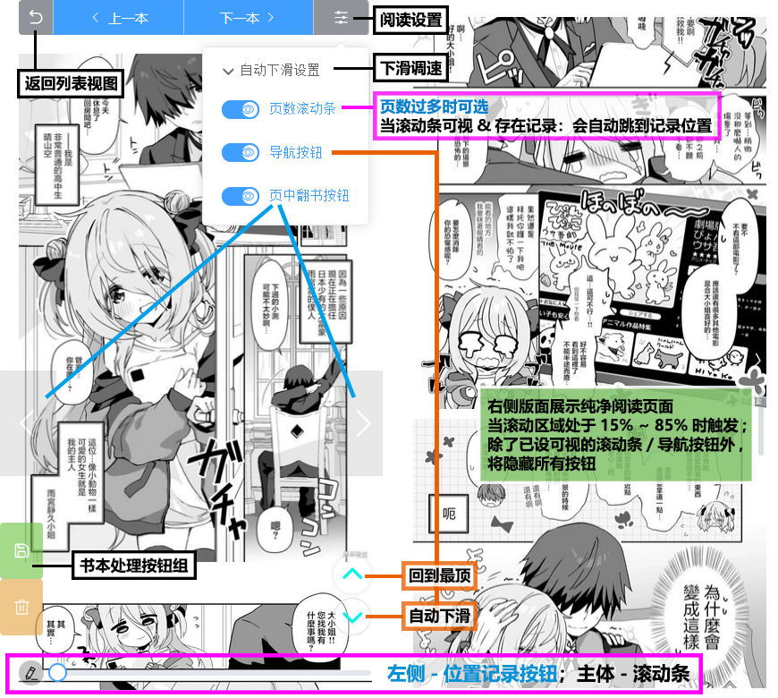

<div align="center">
  <h1 id="koishi">ComicViewer</h1>
  
  
  <a href="https://github.com/jasoneri/comic_viewer/releases" target="_blank">
     
  </a>

  <p align="center">
  <a href="https://github.com/jasoneri/comic_viewer/wiki/FAQ">📖FAQ</a> | 
  <a href="https://github.com/jasoneri/comic_viewer/wiki/Feat">🎲功能说明</a> | 
  <a href="https://github.com/jasoneri/comic_viewer/releases/latest">📦绿色包下载</a>
  </p>
</div>

## 📑介绍

简单练手用的 fastapi + vitejs 前后端分离项目  
pc本地下漫画(或任意图片目录)后用手机浏览器进行局域网阅读

### ▼ 📚列表/网格预览 ▼


> [!Tip]  
> - 「删除模式-丢回收站」过程会有点慢（但其实是异步），介意的话切到「删除模式-彻底删除」 
> - 快速筛选的匹配模式请参考 [🎲功能说明](https://github.com/jasoneri/comic_viewer/wiki/Feat)，用 CGS 下的就不用参考了😎  

### ▼ 📗阅读预览 ▼



> [!Tip]  
> - 建议保留导航按钮或滚动条可视，除非对纯图片阅读有极高要求，否则大页数途中会缺少可动操作  

## 🚀快速开始

### 1.准备/部署

#### 准备

<details>
<summary> 内容目录树参考 👈点击展开</summary>

CGS 下载漫画<u>**并整合章节后(常规漫)**</u>的话就是这结构，否则把漫画放进该目录的 `web` 文件夹内

```shell
D:\Comic                              
   ├── web                            # 放内容（使用`CGS`的话目录结构就是已定的，使用自定义的话就需要创建这个`web`文件夹）
   |    └── GrandBlue碧蓝之海_第62话
   |         ├── 1.jpg
   |         ├── 2.jpg
   |         ......
   └── web_handle                     # 程序创建的操作处理目录
        ├── save                      # 被保存的书
        ├── remove                    # 被移除的书
        └── record.txt                # 保存/移除/删除的记录，与`CGS.exe`的工具箱中的`已阅最新话数记录`关联
```

配置：`backend/conf.yml`中`path`的值，默认`D:\Comic`

</details>

#### 部署

[Python>=3.12](https://python.p2hp.com/downloads/)

```shell
python -m pip install uv -i https://pypi.tuna.tsinghua.edu.cn/simple
python -m uv pip install -r "backend/requirements/windows.txt" --index-url https://pypi.tuna.tsinghua.edu.cn/simple --trusted-host pypi.tuna.tsinghua.edu.cn
```

[nodejs>=22](https://nodejs.cn/en/download)

```shell
cd frontend
npm i
```

### 2.运行

```shell
cd frontend
npm start
```

或在项目根目录运行脚本 `comic_viewer.bat`

### 3.使用

启动后终端会显示局域网ip与端口 `Network:`行，手机进浏览器照样填地址即可，如预览所示  
建议 PC 设置固定局域网 ip

> [🎥使用指南参考](https://www.veed.io/view/zh-CN/688ae765-2bfb-4deb-9495-32b24a273373?panel=comments)，从 `01:52` 开始含有 comic_viewer 的使用部分

## 📢更新

### TODO LIST

✅网格视图模式（首图预览）  
✅本地缓存相关：日夜主题/视图模式/排序，下次打开保持使用习惯  
&emsp;✅移除/删除改为模式切换  
&emsp;✅将筛选值存进本地缓存，点击 重新加载 可以还原初始列表  
&emsp;&emsp;✅增加简易筛选  
&emsp;&emsp;✅筛选对话框增加关键字数组提供选择  
&emsp;&emsp;&emsp;🔳数组从列表改成大面板选择  
✅优化阅读页面-页数滚动条，记录/读取页数  
✅纯净阅读，滚动区域在15~85区间隐藏大部分按钮，把导航按钮组隐藏能做到纯图片浏览  
🔳改book.psd的空白透明  
🔳logo/改名/CGS对应处理  
🔳抛弃 release 发布包，使用 部署/更新/启动 多合一脚本处理，release 仅作为新功能/修复信息公告告示  

> [🕑更新历史](https://github.com/jasoneri/comic_viewer/wiki/Changelog)

## 💬交流

详见 [❓FAQ](https://github.com/jasoneri/comic_viewer/wiki/FAQ) 置顶

## 🔇开源许可

详见 [Apache License 2.0](https://github.com/jasoneri/comic_viewer/blob/master/LICENSE)

---


