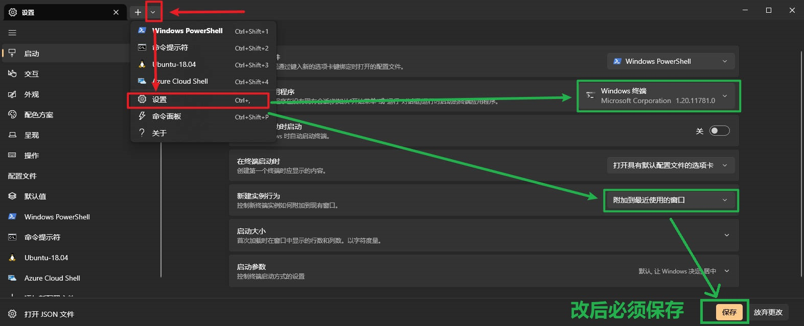
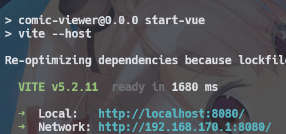

## 必要环境
[点击前往nodejs下载](https://nodejs.org/zh-cn) 并自行自定义安装<br>
[点击前往window终端](https://apps.microsoft.com/detail/9N0DX20HK701?launch=true&mode=full&hl=zh-cn&gl=cn&ocid=bingwebsearch) 并自行安装

### window终端设置
> 开始菜单搜`终端`打开并打开，打开设置（标题栏空白处右键 / `ctrl+逗号` 等方法）
>  1. 启动 > 默认终端应用程序 > 选择 `windows终端`
>  2. 启动 > 新建实例行为 > 选择 `附加到最近使用的窗口`



## 配置
配置文件位置 `scripts\backend\conf.yml` (使用记事本等方式打开)
```yaml
path: D:\Comic
```
按需修改即可放漫画，若联动 `CGS` 漫画下载项目， 需要保持两者的储存目录一致 

## 运行
返回根目录双击 `comic_viewer.exe` 即可



↑ 等前端开启后，会显示局域网地址，点击或手机上输入相同即可


