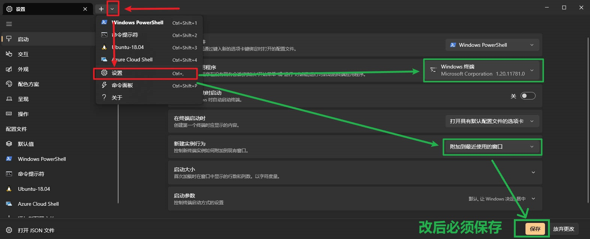
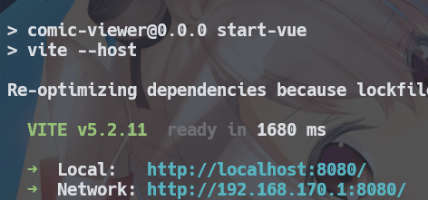
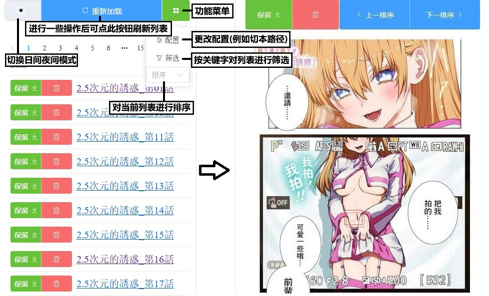

## ⚡️必要环境
[点击前往nodejs下载](https://nodejs.cn/download/current/) 并自行自定义安装 
[点击前往window终端](https://apps.microsoft.com/detail/9N0DX20HK701?launch=true&mode=full&hl=zh-cn&gl=cn&ocid=bingwebsearch) 并自行安装

### window终端设置
开始菜单搜`终端`并打开，打开设置（标题栏空白处右键 / `ctrl+逗号` 等方法） 
1. 启动 > 默认终端应用程序 > 选择 `windows终端` 
2. 启动 > 新建实例行为 > 选择 `附加到最近使用的窗口`

## 🔨配置
配置文件位置 `scripts\backend\conf.yml` (使用记事本等方式打开)

`path: D:\Comic`

按需修改目录即可放漫画（若联动 `CGS` 漫画下载项目， 需要保持两者的储存目录一致） 

> 本的话需要修改成 `path: D:\Comic\本子`，支持热更改

## 🚀运行
返回根目录双击 `comic_viewer.exe` 即可

↑ 等前端开启后，会显示局域网地址，按住ctrl点击或手机上输入相同即可

